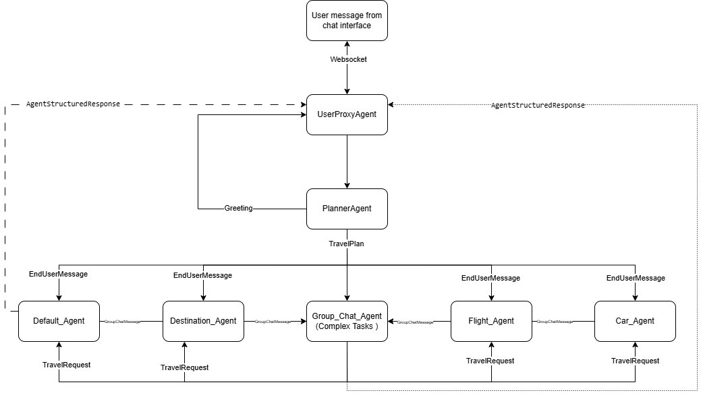

# Travel Chatbot - Multi-Agent System

Autogen core api based chatbot for planning trips, booking flights, hotels, car rentals, and providing destination information. The system routes user requests to specialized agents for a streamlined experience.

## Key Features

Router Agent: Determines user intent and routes messages.
User Proxy Agent: Manages WebSocket connections between users and agents.
Specialized Agents: Handles flights, hotels, car rentals, activities, and destination details.
Group Chat Manager: Coordinates responses from multiple agents to provide a comprehensive travel plan.

## Message Flow

1. **User Interaction**: The user sends a message via the WebSocket connection managed by the UserProxyAgent.
2. **Routing**: The UserProxyAgent forwards the message to the SemanticRouterAgent.
3. **Intent Classification**: The SemanticRouterAgent analyzes the message to determine the user's intent.
4. **Agent Selection**:
   - If the intent maps to a single agent, the message is forwarded directly to that agent.
   - If multiple agents are required, the message is sent to the GroupChatManager.
5. **Task Handling**:
   - **Single Agent**: The selected agent processes the request and sends a response back to the UserProxyAgent, which then sends it to the user.
   - **Group Chat**: The GroupChatManager coordinates between multiple agents, collects their responses, and compiles a final plan. This plan is then sent back to the user via the UserProxyAgent.
6. **Handoff**: If an agent cannot handle the request (e.g., the request is too complex), it sends a HandoffMessage back to the SemanticRouterAgent to re-route or escalate the request. #TODO

High level overview of the message flow:



## Usage

### Running the Application

#### Clone the Repository:

```bash
git clone https://github.com/yourusername/travel-chatbot.git
cd travel-chatbot
```

#### Install Dependencies:

Ensure you have Python 3.11 or higher installed. Install required packages using pip:

```bash
pip install -r requirements.txt
```

#### Set Up Environment Variables:

Create a `.env` file in the `backend` directory with the necessary configuration. Refer to the Configuration section for details.

#### Run the Application:

```bash
uvicorn backend.app:app --host 127.0.0.1 --port 8000
```

#### Access the Chatbot:

Connect to the WebSocket endpoint at `ws://127.0.0.1:8000/chat` to start interacting with the chatbot.

### Testing

The `tests` directory contains test cases to validate the functionality of the chatbot.

#### Run Tests:

```bash
pytest tests/
```

#### Test Chatbot Responses:

The `test_chatbot.py` script sends predefined questions to the chatbot and records responses for evaluation.

## Dependencies

The project uses several external libraries and services:

- **Azure OpenAI**: For language understanding and response generation.
- **Autogen Core and Extensions**: For building agent-based systems.
- **FastAPI**: For the web server and API endpoints.
- **WebSockets**: For real-time communication with users.
- **aiohttp**: For asynchronous HTTP requests.
- **Pydantic**: For data validation and serialization.
- **OpenTelemetry**: For tracing and logging.

## Configuration

The application requires several environment variables to be set, which can be placed in a `.env` file in the `backend` directory:

```ini
# Azure OpenAI Configuration
AZURE_OPENAI_DEPLOYMENT_NAME=your-deployment-name
AZURE_OPENAI_API_VERSION=your-api-version
AZURE_OPENAI_ENDPOINT=your-openai-endpoint
AZURE_OPENAI_API_KEY=your-openai-api-key

# Bing Custom Search
BING_CUSTOM_CONFIG_ID=your-bing-config-id
BING_CUSTOM_SEARCH_KEY=your-bing-search-key
```

## Directory Structure

- `backend`: Contains the main application code.
  - `agents`: Directory containing all agent implementations.
  - `app.py`: Entry point for the FastAPI application.
  - `config.py`: Configuration settings and environment variable handling.
  - `data_types.py`: Definitions of custom data types and message formats.
  - `utils.py`: Utility functions for initializing the agent runtime.
- `tests`: Contains test scripts and fixtures for automated testing.

## Monitoring and Logging

This project uses OpenTelemetry for tracing and logging. Traces are sent to local Aspire backend. [Instruction](https://microsoft.github.io/autogen/0.4.0.dev2/user-guide/core-user-guide/cookbook/instrumenting.html) on how to use OpenTelemetry with Autogen.

## Monitoring and Logging

This project uses OpenTelemetry for tracing and logging. Traces are sent to a local Aspire backend. Follow the instructions at this [link](https://microsoft.github.io/autogen/0.4.0.dev2/user-guide/core-user-guide/cookbook/instrumenting.html) on how to use OpenTelemetry with Autogen.


## Frontend

A simple frontend is provided in the `frontend` directory. It uses NextJs and WebSocket to communicate with the backend.

