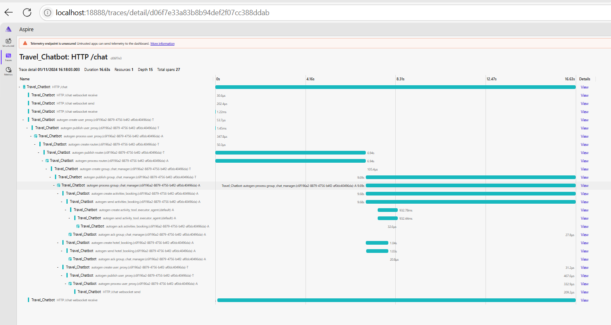
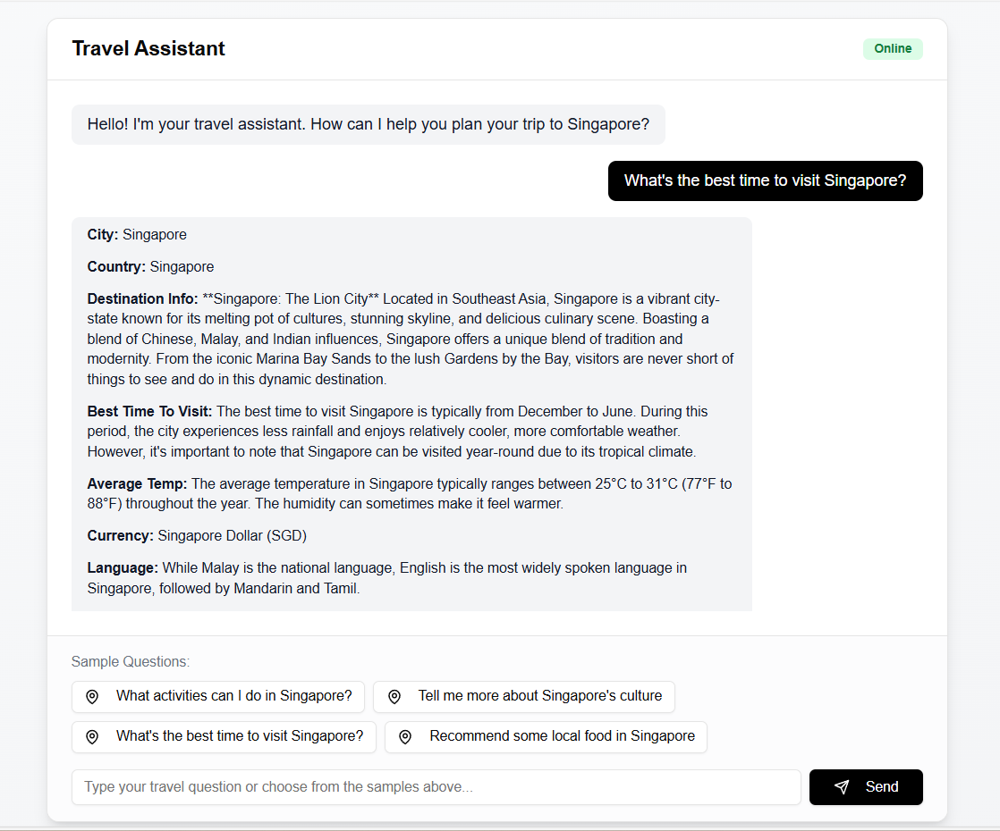

# Travel Chatbot - Multi-Agent System

This repository contains a Python-based multi-agent travel chatbot designed to assist users with travel planning, booking flights, hotels, car rentals, and providing destination information. The system leverages a routing agent to direct user messages to the appropriate specialized agents and uses a group chat manager to coordinate complex tasks involving multiple agents.

## Table of Contents

- [Introduction](#introduction)
- [Architecture Overview](#architecture-overview)
- [Components](#components)
  - [Router Agent](#router-agent)
  - [User Proxy Agent](#user-proxy-agent)
  - [Travel Agents](#travel-agents)
    - [Flight Agent](#flight-agent)
    - [Hotel Agent](#hotel-agent)
    - [Car Rental Agent](#car-rental-agent)
    - [Activities Agent](#activities-agent)
    - [Destination Agent](#destination-agent)
  - [Group Chat Manager](#group-chat-manager)
- [Message Flow](#message-flow)
- [Usage](#usage)
  - [Running the Application](#running-the-application)
  - [Testing](#testing)
- [Dependencies](#dependencies)
- [Configuration](#configuration)
- [Directory Structure](#directory-structure)
- [Conclusion](#conclusion)

## Introduction

The Travel Chatbot is a conversational AI system that assists users in planning and booking their travel itineraries. It uses a multi-agent architecture where each agent specializes in a specific aspect of travel planning. The Router Agent directs user requests to the appropriate agents based on the intent, and the Group Chat Manager coordinates tasks that require multiple agents.

## Architecture Overview

The system is built using an event-driven architecture with the following key components:

- **Router Agent**: Determines the user's intent and routes messages to the appropriate agent(s).
- **User Proxy Agent**: Acts as an interface between the user and the system, handling WebSocket communication.
- **Travel Agents**: Specialized agents for handling flights, hotels, car rentals, activities, and destination information.
- **Group Chat Manager**: Coordinates complex tasks that involve multiple agents, compiling their responses into a cohesive plan.
- **Agent Runtime**: Manages the lifecycle and communication of all agents in the system.

The agents communicate through a messaging system, publishing and subscribing to topics relevant to their functions.

## Components

### Router Agent

- **File**: `backend/agents/travel_router.py`
- **Class**: `SemanticRouterAgent`
- **Function**: Analyzes user messages to determine intent and routes them to the appropriate agent(s). If multiple agents are required, it forwards the request to the Group Chat Manager to coordinate their responses.

### User Proxy Agent

- **File**: `backend/app.py`
- **Class**: `UserProxyAgent`
- **Function**: Manages WebSocket connections with the user, sending and receiving messages. Forwards user messages to the Router Agent and sends agent responses back to the user.

### Travel Agents

#### Default Agent

- **File**: `backend/agents/ext_agents.py`
- **Class**: `DefaultAgent`
- **Function**: Llama index based agent with Wikipedia Tool to help answer questions about the destination or any general information

#### Activities Agent

- **File**: `backend/agents/travel_activities.py`
- **Class**: `ActivitiesAgent`
- **Function**: Provides information on activities and tours in the destination city, utilizing Bing Custom Search to search for keywords and returs a structured output.

#### Car Rental Agent

- **File**: `backend/agents/travel_car.py`
- **Class**: `CarRentalAgent`
- **Function**: Manages car rental bookings, simulating rental options and reservations.

#### Destination Agent

- **File**: `backend/agents/travel_destination.py`
- **Class**: `DestinationAgent`
- **Function**: Supplies general information about the destination, such as weather, best time to visit, and local attractions. It uses the LLM capability to answer and gives out a structured output.

#### Flight Agent

- **File**: `backend/agents/travel_flight.py`
- **Class**: `FlightAgent`
- **Function**: Handles flight booking requests, simulating flight search and booking processes. Can hand off complex requests back to the Router Agent.

#### Hotel Agent

- **File**: `backend/agents/travel_hotel.py`
- **Class**: `HotelAgent`
- **Function**: Handles hotel booking requests, simulating hotel search and booking processes using tools like OpenAI models.

### Group Chat Manager

- **File**: `backend/agents/travel_group_chat.py`
- **Class**: `GroupChatManager`
- **Function**: Orchestrates tasks that require coordination between multiple agents, such as creating a comprehensive travel plan. Collects responses from individual agents and compiles them into a final plan presented to the user.

## Message Flow

1. **User Interaction**: The user sends a message via the WebSocket connection managed by the UserProxyAgent.
2. **Routing**: The UserProxyAgent forwards the message to the SemanticRouterAgent.
3. **Intent Classification**: The SemanticRouterAgent analyzes the message to determine the user's intent.
4. **Agent Selection**:
   - If the intent maps to a single agent, the message is forwarded directly to that agent.
   - If multiple agents are required, the message is sent to the GroupChatManager.
5. **Task Handling**:
   - **Single Agent**: The selected agent processes the request and sends a response back to the UserProxyAgent, which then sends it to the user.
   - **Group Chat**: The GroupChatManager coordinates between multiple agents, collects their responses, and compiles a final plan. This plan is then sent back to the user via the UserProxyAgent.
6. **Handoff**: If an agent cannot handle the request (e.g., the request is too complex), it sends a HandoffMessage back to the SemanticRouterAgent to re-route or escalate the request. #TODO

## Usage

### Running the Application

#### Clone the Repository:

```bash
git clone https://github.com/yourusername/travel-chatbot.git
cd travel-chatbot
```

#### Install Dependencies:

Ensure you have Python 3.11 or higher installed. Install required packages using pip:

```bash
pip install -r requirements.txt
```

#### Set Up Environment Variables:

Create a `.env` file in the `backend` directory with the necessary configuration. Refer to the Configuration section for details.

#### Run the Application:

```bash
uvicorn backend.app:app --host 127.0.0.1 --port 8000
```

#### Access the Chatbot:

Connect to the WebSocket endpoint at `ws://127.0.0.1:8000/chat` to start interacting with the chatbot.

### Testing

The `tests` directory contains test cases to validate the functionality of the chatbot.

#### Run Tests:

```bash
pytest tests/
```

#### Test Chatbot Responses:

The `test_chatbot.py` script sends predefined questions to the chatbot and records responses for evaluation.

## Dependencies

The project uses several external libraries and services:

- **Azure OpenAI**: For language understanding and response generation.
- **Autogen Core and Extensions**: For building agent-based systems.
- **FastAPI**: For the web server and API endpoints.
- **WebSockets**: For real-time communication with users.
- **aiohttp**: For asynchronous HTTP requests.
- **Pydantic**: For data validation and serialization.
- **OpenTelemetry**: For tracing and logging.

## Configuration

The application requires several environment variables to be set, which can be placed in a `.env` file in the `backend` directory:

```ini
# Cosmos DB Configuration
COSMOSDB_ENDPOINT=your-cosmosdb-endpoint
COSMOSDB_DATABASE=your-database-name
COSMOSDB_CONTAINER=your-container-name

# Azure OpenAI Configuration
AZURE_OPENAI_DEPLOYMENT_NAME=your-deployment-name
AZURE_OPENAI_API_VERSION=your-api-version
AZURE_OPENAI_ENDPOINT=your-openai-endpoint
AZURE_OPENAI_API_KEY=your-openai-api-key

# Bing Custom Search
BING_CUSTOM_CONFIG_ID=your-bing-config-id
BING_CUSTOM_SEARCH_KEY=your-bing-search-key

# Development Settings
DEV_BYPASS_AUTH=true
VISITOR_PASSWORD=your-visitor-password
```

## Directory Structure

- `backend`: Contains the main application code.
  - `agents`: Directory containing all agent implementations.
  - `app.py`: Entry point for the FastAPI application.
  - `config.py`: Configuration settings and environment variable handling.
  - `data_types.py`: Definitions of custom data types and message formats.
  - `utils.py`: Utility functions for initializing the agent runtime.
- `tests`: Contains test scripts and fixtures for automated testing.

## Monitoring and Logging

This project uses OpenTelemetry for tracing and logging. Traces are sent to local Aspire backend. [Instruction](https://microsoft.github.io/autogen/0.4.0.dev2/user-guide/core-user-guide/cookbook/instrumenting.html) on how to use OpenTelemetry with Autogen.

## Monitoring and Logging

This project uses OpenTelemetry for tracing and logging. Traces are sent to a local Aspire backend. Follow the instructions at this [link](https://microsoft.github.io/autogen/0.4.0.dev2/user-guide/core-user-guide/cookbook/instrumenting.html) on how to use OpenTelemetry with Autogen.



## Frontend

A simple frontend is provided in the `frontend` directory. It uses NextJs and WebSocket to communicate with the backend.

